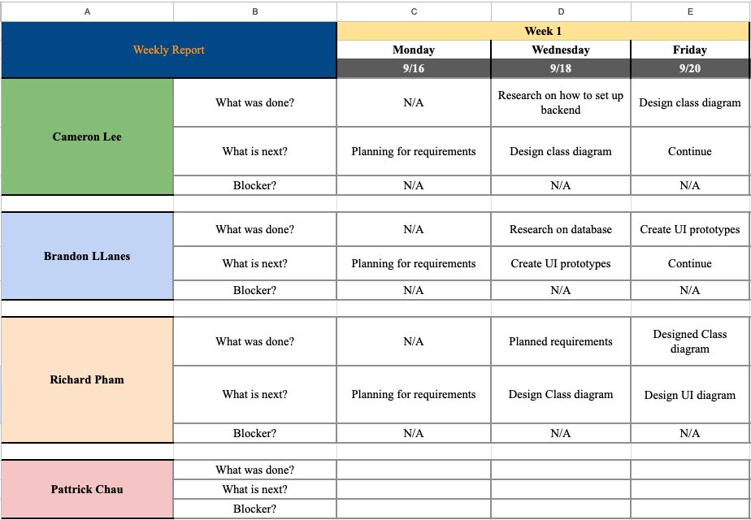
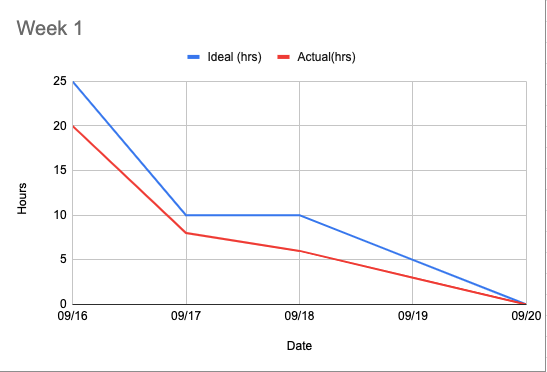
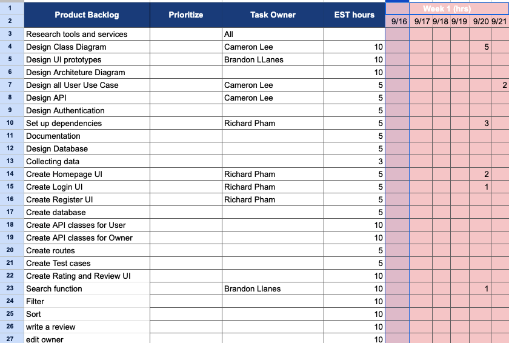
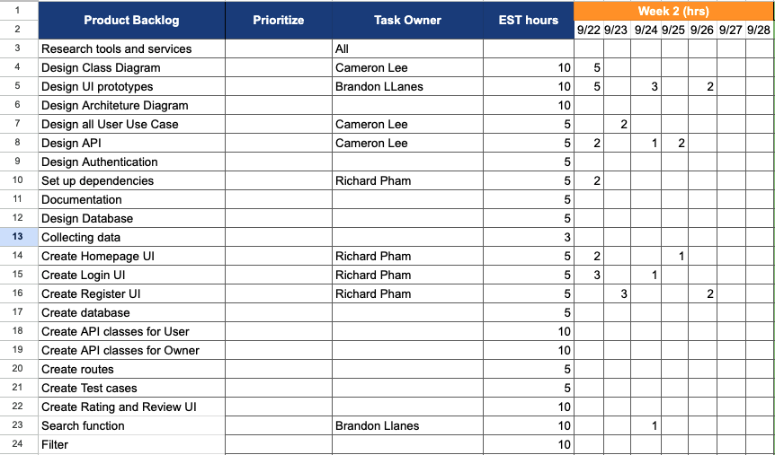
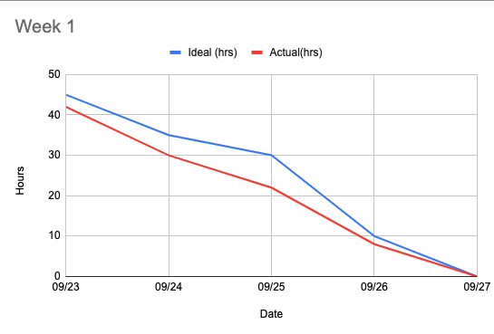
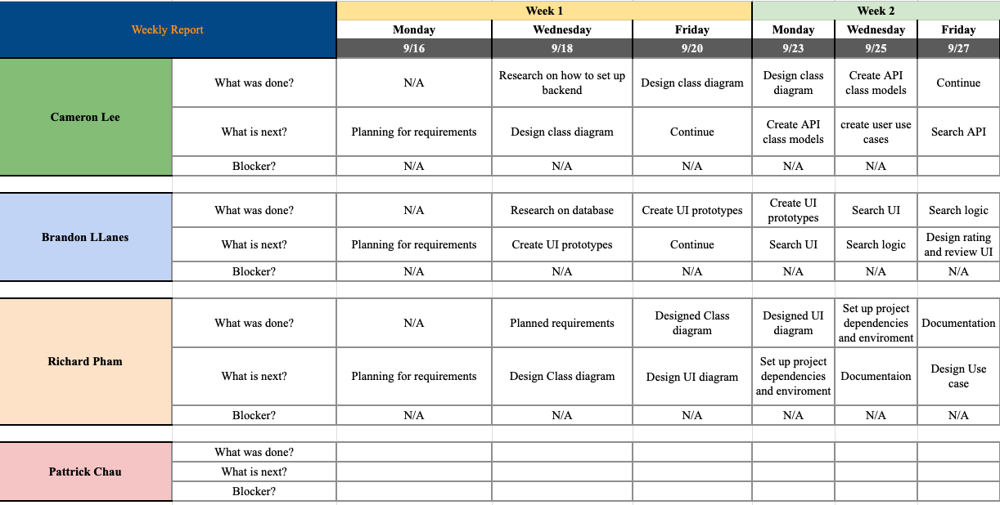

# Foodie

## [Link to Github](https://github.com/gopinathsjsu/team-project-cmpe202_fall24_foodie)

## Team member

Frontend:
Backend:

## Team Contribution Summary

## Features

    1. Register user
    2. View user profile
    3. Login as Business owner
    5. Login as user
    6. Logout
    7. Search for restaurants by name, categories
    8. Search for restaurants by location
    8. Submit Reviews and Ratings
    9. View details
    10. Add new listing as owner
    11. Update restaurant info as owner
    12. Add/Update descriptions, photos as owner
    13. View restaurant chains list owned as owner
    14. Delete restaurant

## Notes:

Frontend 1. Install Node.js 2. Go into frontend directory 3. Install npm dependencies: npm install 4. Start frontend server: npm run dev

    Deploy

### Sprint Notes

Meeting every MWF

1. Sprint Meeting 1 (09/20):
   We planned to split the app into 2 parts: front end interface (ReactJS) and backend API(Java Spring Boot). We decided to start with some UI designs on Figma and set up the project including dependiences and tools.

2. Sprint Meeting 2 (09/23, 25, 27):
   On this sprint, we focus on designing the rest of the system and start implementing basic functions for the front end and back end.

3. Sprint Meeting 3 (09/30, 10/2, 4):
   Sprint 3 we focus on setting authentication UI page and homepage, continuing setting up the backend and a few API endpoints so the frontend can call and integrate with the backend. More business rules and user models are created.

### SCRUM Task Sheets

1. Sprint 1

- Backlog
  
- Burndown Chart
  
- Weekly report
  

2. Sprint 2

- Backlog
  
- Burndown Chart
  
- Weekly report
  

3. Sprint 3

- Backlog
- Burndown Chart
- Weekly report

4. Sprint 4

- Backlog
- Burndown Chart
- Weekly report
